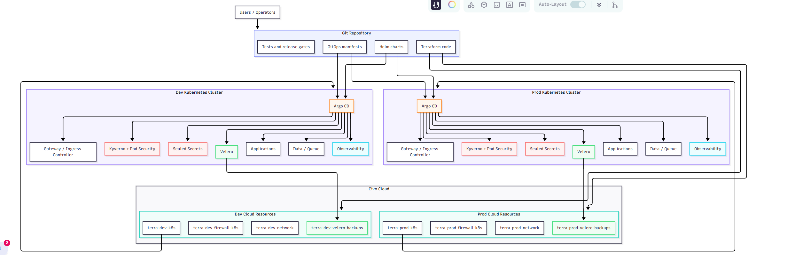

# Platform Architecture

## Mission

Build and operate a production-style Kubernetes application platform on Civo using Terraform, Helm, Argo CD, Kyverno, Sealed Secrets, Velero, and automated testing.

## Environments

| Environment | Cluster | Purpose |
|---|---|---|
| dev | separate Civo Kubernetes cluster | integration, testing, failure practice |
| prod | separate Civo Kubernetes cluster | production-style release target |

## Responsibility Boundary

Terraform manages cloud infrastructure and foundational platform resources.

Argo CD manages in-cluster workloads, Helm releases, application configuration, policy resources, and GitOps reconciliation.

## Planned Node Pools

| Pool | Purpose |
|---|---|
| system | Kubernetes/platform controllers |
| ingress | ingress or Gateway API workloads |
| apps | frontend/backend/admin application pods |
| workers | worker services, CronJobs, Jobs |
| observability | monitoring and operational tooling |

## Planned Applications

| Application | Exposure | Purpose |
|---|---|---|
| frontend | public | user-facing web app |
| backend-api | internal | application API |
| worker | internal | background processing |
| queue | internal | async/event communication |
| database | internal | persistent data |
| cronjob | internal | scheduled task |
| admin | internal-only | operational/admin surface |
| observability | restricted | monitoring |

## Security Principles

- Least privilege RBAC.
- Namespace isolation.
- Non-root workloads.
- Read-only filesystems where practical.
- Restricted Pod Security posture.
- Kyverno policy enforcement.
- Sealed Secrets for Git-safe secrets.
- NetworkPolicies for explicit traffic control.

## Disaster Recovery Principles

- Velero backs up Kubernetes resources.
- Persistent data backup is tested, not assumed.
- Restore procedures are documented.
- Dev is used for destructive recovery practice before prod.

## Platform Architecture Diagram




## Responsibility Map

| Area | Primary Owner | Why |
|---|---|---|
| Civo networks | Terraform | Cloud infrastructure should be planned, reviewed, and applied predictably. |
| Civo firewalls | Terraform | Firewall changes affect access boundaries and should be visible in Terraform plans. |
| Civo Kubernetes clusters | Terraform | Cluster lifecycle is infrastructure lifecycle. |
| Civo node pools | Terraform | Node capacity, size, and pool layout belong to infrastructure. |
| Civo object stores | Terraform | Backup storage is foundational infrastructure. |
| Kubeconfig handling | Terraform output / operator workflow | Terraform can expose connection data, but kubeconfig files must be handled carefully. |
| Argo CD installation bootstrap | GitOps bootstrap process | Argo CD must exist before it can reconcile the rest of the platform. |
| Application deployments | Argo CD + Helm | Applications should be delivered continuously from Git, not manually applied. |
| Kubernetes namespaces | Argo CD | Namespaces are part of the in-cluster platform contract. |
| Kubernetes RBAC | Argo CD | Access rules should be reviewed and reconciled from Git. |
| NetworkPolicies | Argo CD | Service-to-service access is workload configuration and must evolve with apps. |
| Kyverno policies | Argo CD | Policy enforcement is part of the cluster desired state. |
| SealedSecret resources | Argo CD | Encrypted secret manifests are safe to store in Git and reconciled into the cluster. |
| Plain Kubernetes Secrets | Sealed Secrets controller | Plain Secrets should be generated inside the cluster, not committed directly to Git. |
| Gateway / Ingress routes | Argo CD | Traffic routing is application/platform configuration. |
| Velero installation | Argo CD after bootstrap | The controller runs in-cluster and should be reconciled from Git. |
| Velero backup storage | Terraform | The external object store is cloud infrastructure. |
| Backup schedules | Argo CD | Schedules are Kubernetes resources and part of operational desired state. |
| Helm chart source | Git | Charts are versioned delivery artifacts. |
| Environment Helm values | Git | Differences between dev and prod must be explicit and reviewable. |
| Terraform tests | Test pipeline / operator | Infrastructure changes need validation before apply. |
| Helm and manifest tests | Test pipeline / operator | Rendered Kubernetes resources must be checked before GitOps sync. |


## Terraform State Strategy

Terraform state is treated as a blast-radius boundary.

Each major environment layer has its own Terraform root module and backend state.

Planned root modules:

| Root Module | Purpose |
|---|---|
| platform/terraform/envs/dev/network | dev network and firewall foundation |
| platform/terraform/envs/dev/cluster | dev Kubernetes cluster and node pools |
| platform/terraform/envs/dev/backup | dev backup object storage |
| platform/terraform/envs/prod/network | prod network and firewall foundation |
| platform/terraform/envs/prod/cluster | prod Kubernetes cluster and node pools |
| platform/terraform/envs/prod/backup | prod backup object storage |

Reusable modules live under:

```text
platform/terraform/modules/